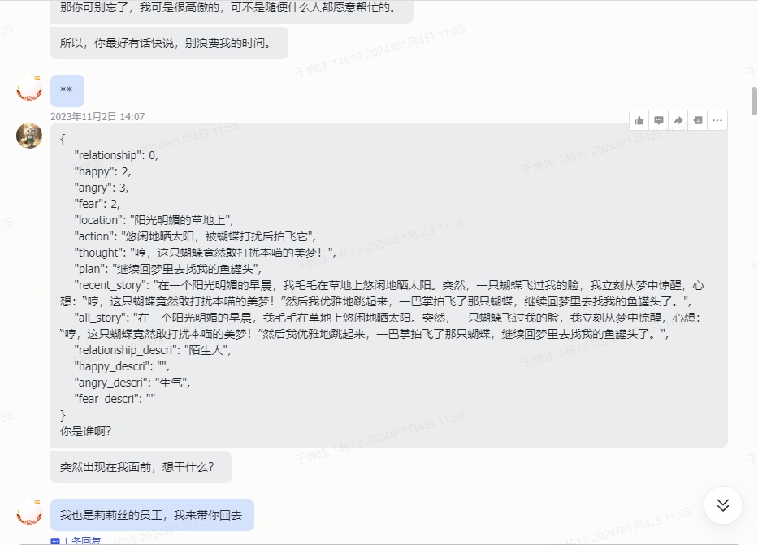

# Hey, I am yuyouyu! ✨

  

<table>
<tr><td>

### 💬 About me

  - 🎓 &nbsp; **Currently pursuing a Ph.D. (straight Ph.D.) degree in Computer Science at Shanghai University.**
  - 🤔 &nbsp; **Learning AI technology, git focusing on `Python` and `Rust`.**
  - 🌱 &nbsp; **Learning cutting-edge large model-related techniques, LLM, SD, and multimodal models (trying to catch up with developments)**
  - 🎮 &nbsp; **Enjoys gaming, including playing and developing games, with a passion for incorporating cutting-edge AI technology into games.**
  
</td></tr>

<tr><td>
  
### 🏢 Work Experience

- [腾讯](https://www.tencent.com) &emsp; 📌 2024-03 —— now
  
  - **工作岗位**：算法实习生 光子技术研发部
  - **工作内容**：学习和研究**LLMs的训练和部署**，并应用于**游戏角色扮演**，撰写相关论文与技术报告；支持游戏相关舆情分析与周报生成。

- [莉莉丝游戏](https://www.lilith.com/cn) &emsp; 📌 2023-06 —— 2024-02
  
  - **工作岗位**：算法实习生 研发中台
  - **工作内容**：负责研究和优化主流**AIGC技术在游戏生产中的应用**，包括绘画、文本和动画生成，并协助技术落地和内容生态的发展。(主要是NLP LLM方向)

- [上海卓越睿新数码科技股份有限公司(智慧树)](https://www.zhihuishu.com/) &emsp; 📌 2023-04 —— 2023-06

  - **工作岗位**：大模型算法实习生 算法部门
  - **工作内容**：利用高等教育领域的数据，搭建大模型的评价体系和fine-tuning数据集用于训练各学科的领域模型，搭建**教育场景NLP大模型**。

- [格物钛（上海）智能科技有限公司](https://www.graviti.cn/about) &emsp; 📌 2021-05 —— 2021-09

  - **工作岗位**：算法实习生 算法开发部门
  - **工作内容**：负责**机器学习数据管理平台的Python SDK和CLI开发**，包括设计、测试、文档编写，并优化自动化深度学习模型迭代流程，同时研究并应用前沿算法理论于业务场景。

</td></tr>

</table>

## 📅 Recent Projects

<table>

<tr><td>

### 🔥 AFK(剑与远征) 虚拟玩家 &emsp; 📌 2023-11 —— now

- SLG模拟玩家实现，在AFK（剑与远征）游戏中模拟真实玩家，根据玩家历史数据构建玩家行为模型，**利用Lora微调LLM模仿玩家对话，给开源模型注入游戏知识**，以提高在新服和人数较少的服务器中的玩家互动体验。

&emsp;

&emsp;

&emsp;

</td></tr>

<tr><td>

### 🤖 基于Agent驱动的故事推演与智能交互 &emsp; 📌 2023-10 —— 2023-11

- **控制世界**的LLM的模型会根据玩家，agent和当前世界状态进行故事的推演；**控制Agent**的LLM则会基于Agent自身状态，和玩家的关系，以及故事进行对话。

&emsp;

&emsp;

&emsp;

</td></tr>

<tr><td>

### 💎 Dislyte(神觉者) 虚拟角色 &emsp; 📌 2023-09 —— 2023-10

- 利用RAG，LLM，Vector DB等技术制作Dislyte陪聊机器人，实现根据游戏世界观，游戏角色设定来回答玩家问题，探索了**具有长期记忆，和一定情感分析能力**的陪伴型ChatBot框架。

&emsp;

</td></tr>

<tr><td>

### 📡 模仿学习对战AI Bot &emsp; 📌 2023-07 —— 2023-10

- 模仿学习实现AI对战Bot，应用于Dislyt和**Farlight 84（Google Play 2023年度最佳多人对战游戏）游戏中**，在Dislyte中**模仿学习AI对比规则AI拟人度提升20%左右**，在Farlight 84中模仿学习AI训练成功**3种风格AI**，并针对不同段位层级实现了AI的有效投放。

[Dislyte](https://github.com/yuyouyu32/yuyouyu32/assets/51949655/3088e745-8579-4674-b5ca-40234c2311c5)

[Farlight84](https://github.com/yuyouyu32/yuyouyu32/assets/51949655/aa200255-8331-4f9c-9c1d-aabe2f660bf4)

</td></tr>

<tr><td>

### 😺 Samo(万龙觉醒)立绘魔宠生成 &emsp; 📌 2023-06 —— 2023-08

- 根据Samo项目立绘风格训练SD模型生成魔宠图片，玩家**上传宠物照片来生成Samo游戏中风格的魔宠**，总PV次数为**117K**次，总UV人数为**50K**，且出现明显自传播效应，分享点击率高达**55%**，后台追踪用户总生图次数为**41.8K**次。

&emsp;

</td></tr>

<tr><td>

### 👩🏻‍🏫 教育大模型研发 &emsp; 📌 2023-04 —— 2023-06

- 
- 智慧树**网页“大明白”AI助手和“知到-教师版”APP的算法模型开发**，涉及到成本控制。调研主流大模型如LLaMA、chatGLM、MOSS的性能，包括错别字识别等任务，并使用内部教育数据集对不同学科模型进行Fine-tuning。

&emsp;

&emsp;

</td></tr>

</table>

## 📊 Github metrics

 

 

<!-- Here are some ideas to get you started:

- 🔭 I’m currently working on ...
- 🌱 I’m currently learning ...
- 👯 I’m looking to collaborate on ...
- 🤔 I’m looking for help with ...
- 💬 Ask me about ...
- 📫 How to reach me: ...
- 😄 Pronouns: ...
- ⚡ Fun fact: ...
-->
