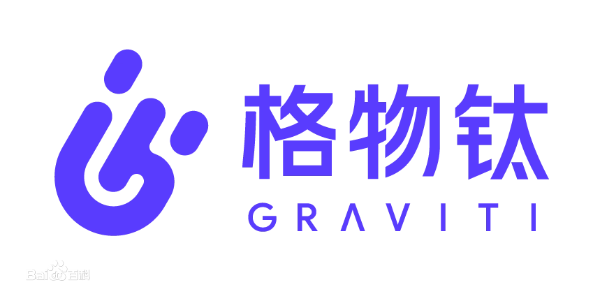
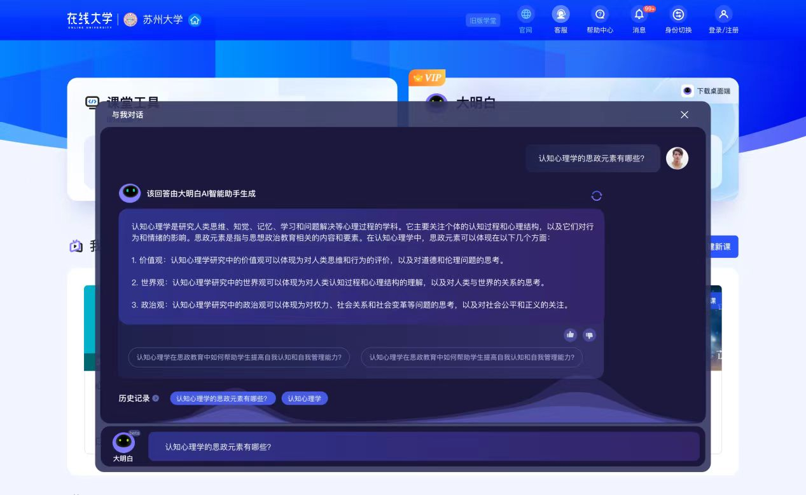
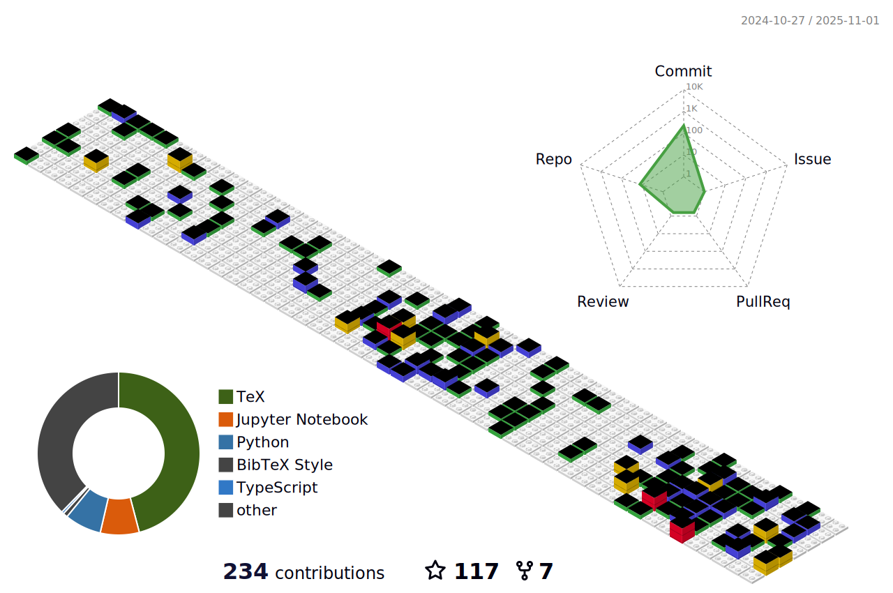

# Hey, I am yuyouyu! ✨

  

<table>
<tr><td>

### 💬 About me

  - 🎓 &nbsp; **Currently pursuing a Ph.D. (straight Ph.D.) degree in Computer Science at Shanghai University.**
  - 🤔 &nbsp; **Learning AI technology, git focusing on `python` and `cpp`.**
  - 🌱 &nbsp; **Learning cutting-edge large model-related techniques, LLM, SD, and multimodal models (trying to catch up with developments)**
  - 🎮 &nbsp; **Enjoys gaming, including playing and developing games, with a passion for incorporating cutting-edge AI technology into games.**
  
</td></tr>

<tr><td>
  
### 🏢 Work Experience

- [腾讯](https://www.tencent.com) &emsp; 📌 2024-03 —— now
  
  - **工作岗位**：算法实习生 光子技术研发部
  - **工作内容**：撰写**角色扮演LLMs论文**；支持游戏相关舆情平台构建；不同游戏项目AI接入（如AI陪伴、AI教练、AI队友等）。

- [莉莉丝游戏](https://www.lilith.com/cn) &emsp; 📌 2023-06 —— 2024-02
  
  - **工作岗位**：算法实习生 研发中台
  - **工作内容**：负责研究和优化主流**AIGC技术在游戏生产中的应用**，包括绘画、文本和动画生成，并协助技术落地和内容生态的发展(主要是NLP LLM方向)；通过模仿学习构建SLG和FPS游戏的对战AI。

- [上海卓越睿新数码科技股份有限公司(智慧树)](https://www.zhihuishu.com/) &emsp; 📌 2023-04 —— 2023-06

  - **工作岗位**：大模型算法实习生 算法部门
  - **工作内容**：利用高等教育领域的数据，搭建大模型的评价体系和fine-tuning数据集用于训练各学科的领域模型，搭建**教育场景NLP大模型**。

- [格物钛（上海）智能科技有限公司](https://www.graviti.cn/about) &emsp; 📌 2021-05 —— 2021-09

  - **工作岗位**：算法实习生 算法开发部门
  - **工作内容**：负责**机器学习数据管理平台的Python SDK和CLI开发**，包括设计、测试、文档编写，并优化自动化深度学习模型迭代流程，同时研究并应用前沿算法理论于业务场景。

</td></tr>

</table>

## 📑 Papers
<table>
<tr><td>

### 📄 Beyond Dialogue: A Profile-Dialogue Alignment Framework Towards General Role-Playing Language Mode (Submitted to AAAI25)

  
<strong>第一作者</strong>

  
<strong>上海大学，腾讯，香港科技大学</strong>

- 目前的RP训练流程中使用**全局视角下定义的角色profile来指导dialogue的生成**，然而目前收集的对话基本上不可能在一个情景下体现全部的profile内容，就会出现**profile和dialogue不对齐**的问题，导致训练时出现Bias **（Prompt中要求体现的角色特性在Lable对话中没有体现，甚至有冲突）**。
- 该研究首先提出了一套全自动低成本的RP数据集构建pipeline，同时设计一个**简单有效的框架对齐profile和dialogue**，并通过Beyond Dialogue的衍生任务在**sentence level**上学习并提高角色扮演的细粒度对齐能力。
- 为了自动有效的评估LLMs的RP能力，我们构建了一个自动生成对话角色、场景和对话内容的pipeline，**评估模型在相同设定下对profile的遵循程度**，并将评估任务都转换成 **客观题（判断、选择题）** 来降低评估LLMs的能力要求与提高评估有效性。
- **Paper: https://web3.arxiv.org/abs/2408.10903**
- **Code: https://github.com/yuyouyu32/BeyondDialogue**
  
</tr></td>

<tr><td>

### 📄 From Small Data Modeling to Large Language Model Screening: A Dual-Strategy for Materials Intelligent Design（Advanced Science, JCR Q1, IF 14.3）

  
<strong>第一作者</strong>

  
<strong>上海大学，香港科技大学</strong>

- 目标域数据量少，ML建模精度低，提出了一个**耦合的特征表示和对抗生成域自适应网络，引入了协方差距离和残差连接**，以缩小源域和目标域之间的表征差异。
- 利用迁移之后的表征向量在目标域和源域上ML精度大幅提升，基于高精度模型设计新的候选方案，并**利用LLMs的自检索、自总结能力对候选方案进行筛选评估**。
- **Paper: https://advanced.onlinelibrary.wiley.com/doi/10.1002/advs.202403548?af=R**
- **Code: https://github.com/yuyouyu32/DSMID**
  
</tr></td>

<tr><td>

### 📄 Better utilization of materials’ compositions for predicting their properties: Material composition visualization network (EAAI，JCR Q1，IF 7.8，CCF B)

  
<strong>第一作者</strong>

  
<strong>上海大学，之江实验室</strong>

- 在小样本数据集上**利用领域知识扩充数据特征**，稠密化输入特征来丰富ML建模信息。
- 为了保障模型在小数据集中的泛化性，设计算法将高维特征映射为图片，使用**CNN的特性来保障高维度数据在小样本上的收敛性**，利用多模态联合其余无法转换的特征进行ML建模。
- **Paper: https://www.sciencedirect.com/science/article/pii/S0952197622005292**
- **Code: https://github.com/yuyouyu32/MCVN**
  
</tr></td>

</table>

## 📅 Recent Projects

<table>

<tr><td>

### 💭 英雄联盟手游 LLMs算法支持 &emsp; 📌 2024-03 —— now

- 英雄联盟手游AI Pet以及AI Coach项目开发，**AI Pet用于闲聊与解答游戏相关问题，AI Coach用于在对局中对玩家进行教学，如死亡分析，对战策略，大局观指导等**，目前AI宠物已经上线，AI Coach处于内测。

</td></tr>

<tr><td>

### 🎭 通用Role-playing LLMs研究 &emsp; 📌 2024-04 —— 2024.08

- 提出了一套**全自动低成本构建RP数据集和RP评估的框架**，**解决了目前RP训练中prompt和label不对齐的bias问题**，微调开源Qwen2-7B的模型使其**对RP profile遵循能力超越市面上所有闭源的通用模型（GPT-4o，Claude）和RP模型（BaichuanNPC，CharacterGLM，Index）**。

&emsp;

</tr></td>

<tr><td>

### 📊 游戏舆情分析平台算法支撑 &emsp; 📌 2024-03 —— 2024.06

- 游戏舆情分析平台构建，通过NLP相关技术（情感分类，文本聚类，信息总结），对网络上爬取得到的**游戏舆情进行自动化的分类、总结**，全流程自动化构建舆情报告（如情感分类，关键词抓取，信息总结等）。

&emsp;

</td></tr>

<tr><td>

### 🐈 回家的猫（微信小游戏）聊天算法支撑与文案生成 &emsp; 📌 2023-11 —— 2024.02

- **回家的猫 微信小游戏**LLMs算法支撑，与玩家进行与"旅行"相关话题的闲聊，**训练两种性格和说话风格的喵咪与玩家进行交互**，并支持文案创作（旅行文案、随机故事等的生成）。

&emsp;

&emsp;

</td></tr>

<tr><td>

### 🔥 AFK(剑与远征) 虚拟玩家 &emsp; 📌 2023-11 —— 2024.02

- SLG模拟玩家实现，在AFK（剑与远征）游戏中模拟真实玩家，根据玩家历史数据构建玩家行为模型，**利用Lora微调LLM模仿玩家对话，给开源模型注入游戏知识**，以提高在新服和人数较少的服务器中的玩家互动体验。

&emsp;

&emsp;

&emsp;

</td></tr>

<tr><td>

### 🤖 基于Agent驱动的故事推演与智能交互 &emsp; 📌 2023-10 —— 2023-11

- **控制世界**的LLM的模型会根据玩家，agent和当前世界状态进行故事的推演；**控制Agent**的LLM则会基于Agent自身状态，和玩家的关系，以及故事进行对话。

&emsp;

&emsp;

&emsp;

</td></tr>

<tr><td>

### 💎 Dislyte(神觉者) 虚拟角色 &emsp; 📌 2023-09 —— 2023-10

- 利用RAG，LLM，Vector DB等技术制作Dislyte陪聊机器人，实现根据游戏世界观，游戏角色设定来回答玩家问题，探索了**具有长期记忆，和一定情感分析能力**的陪伴型ChatBot框架。

&emsp;

</td></tr>

<tr><td>

### 📡 模仿学习对战AI Bot &emsp; 📌 2023-07 —— 2023-10

- 模仿学习实现AI对战Bot，应用于Dislyt和**Farlight 84（Google Play 2023年度最佳多人对战游戏）游戏中**，在Dislyte中**模仿学习AI对比规则AI拟人度提升20%左右**，在Farlight 84中模仿学习AI训练成功**3种风格AI**，并针对不同段位层级实现了AI的有效投放。

|      Dislyt      | 规则AI   | 机器学习AI (BUFF版) |
|--------------|:--------:|:------------------:|
| 技能选择      |  70.9%   |       90.9%        |
| 敌人选择      |  62.0%   |       75.4%        |
| 队友选择      |  30.0%   |       63.2%        |

- **Dislyte AI对战视频：**

[Dislyte](https://github.com/yuyouyu32/yuyouyu32/assets/51949655/3088e745-8579-4674-b5ca-40234c2311c5)

- **Farlight 84 AI对战视频：**

[Farlight84](https://github.com/yuyouyu32/yuyouyu32/assets/51949655/aa200255-8331-4f9c-9c1d-aabe2f660bf4)

</td></tr>

<tr><td>

### 😺 Samo(万龙觉醒)立绘魔宠生成 &emsp; 📌 2023-06 —— 2023-08

- 根据Samo项目立绘风格训练SD模型生成魔宠图片，玩家**上传宠物照片来生成Samo游戏中风格的魔宠**，总PV次数为**117K**次，总UV人数为**50K**，且出现明显自传播效应，分享点击率高达**55%**，后台追踪用户总生图次数为**41.8K**次。

&emsp;

</td></tr>

<tr><td>

### 👩🏻‍🏫 教育大模型研发 &emsp; 📌 2023-04 —— 2023-06

- 智慧树网页"**大明白**"**AI助手和**"**知到-教师版**"**APP的算法模型开发**，涉及到成本控制。调研主流大模型如LLaMA、chatGLM、MOSS的性能，包括错别字识别等任务，并使用内部教育数据集对不同学科模型进行Fine-tuning。

&emsp;

&emsp;

</td></tr>

</table>

## 📊 Github metrics

 

 

<!-- Here are some ideas to get you started:

- 🔭 I’m currently working on ...
- 🌱 I’m currently learning ...
- 👯 I’m looking to collaborate on ...
- 🤔 I’m looking for help with ...
- 💬 Ask me about ...
- 📫 How to reach me: ...
- 😄 Pronouns: ...
- ⚡ Fun fact: ...
-->
